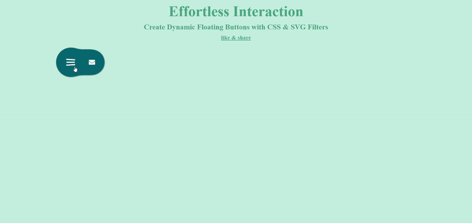
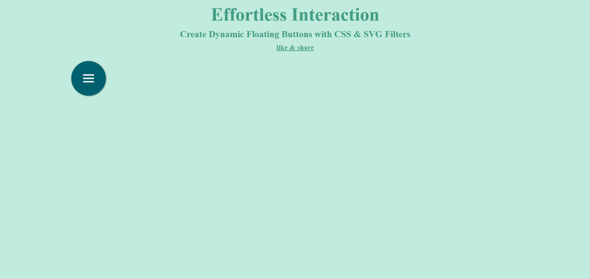
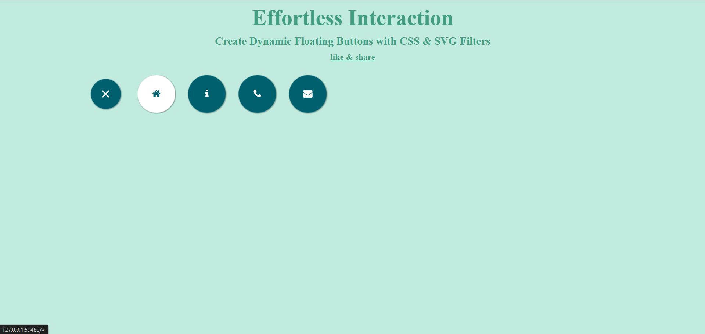

# Effortless Interaction: Floating Button Using CSS and SVG Filters

<a href="https://www.linkedin.com/in/dharmendraverma95/" target="_blank">LinkedIn Profile </a>

<a href="https://www.behance.net/dhirukumar" target="_blank">Behance Profile </a>

# Overview

<strong>Floating Button Using CSS and SVG Filters</strong> is a sleek, modern solution for adding floating buttons to your website with enhanced visual effects. Using only CSS for layout and SVG filters for special effects, this project allows you to create a visually appealing and interactive floating button that catches the user's attention without relying on JavaScript.

This floating button can be used for a variety of actions such as triggering popups, opening menus, or navigating to important sections on your site.

### Features
<ul>
  <li>No JavaScript: The floating button is powered solely by CSS and SVG filters, keeping your site lightweight and fast.
</li>
  <li>SVG Filters: Unique and customizable visual effects, such as shadows, glows, and blurs, all done using SVG filters.</li>
  <li>Responsive: The floating button is designed to work on all screen sizes and devices.</li>
  <li>Customizable: Easily adjust the button size, position, color, and SVG filter effects to fit your website’s design.</li>
  <li>Interactive: Engaging hover effects for better user interaction.
</li>
</ul>

# Demo / Preview

 
Floating Button Using CSS and SVG Filters [ Rest & Active State ] Desgin & Animation 
 

 
Floating Button Using CSS and SVG Filters[ Rest & Hover State ]
 

 
###### Lang
<ul>
  <li>Graphic Design Software: Photoshop, Figma (for mockups)</li>
  <li>Web Tools (Optional): HTML5, SCSS for any digital presentations or landing pages</li>
  <li>Font Awesome & Google Fonts  (Optional for icons )</li>

</ul>

